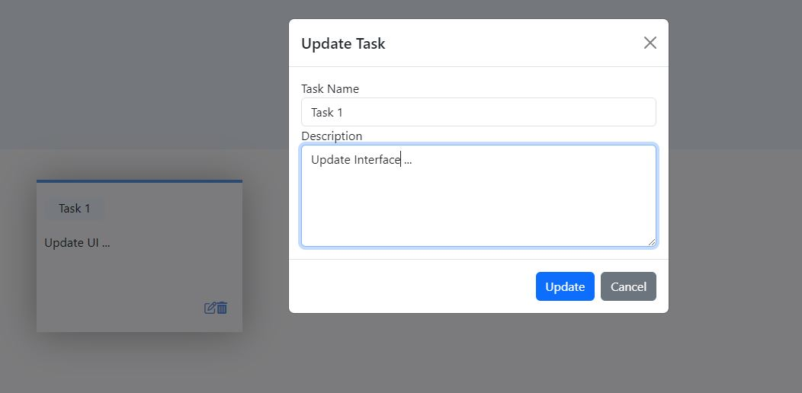

# To-Do-Application
To-Do Application using React.js

## Description:
To-Do list Application which focuses on React.js alongside Reactstrap / Bootstrap for UI. Local storage is used to store and retrieve data.

## Snapshots

### Index Page:

### Create Task::

### Update Task:

## Multiple Tasks:

